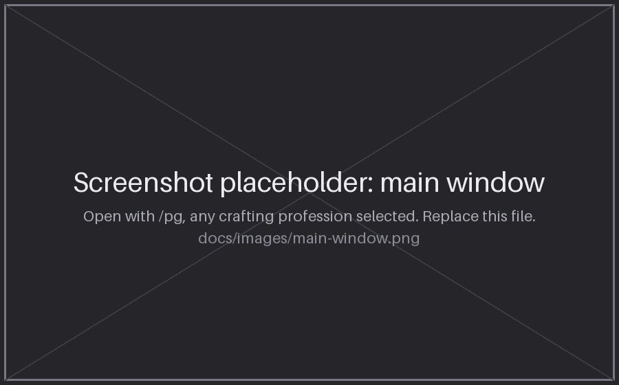
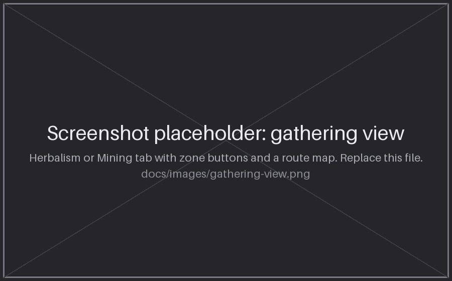
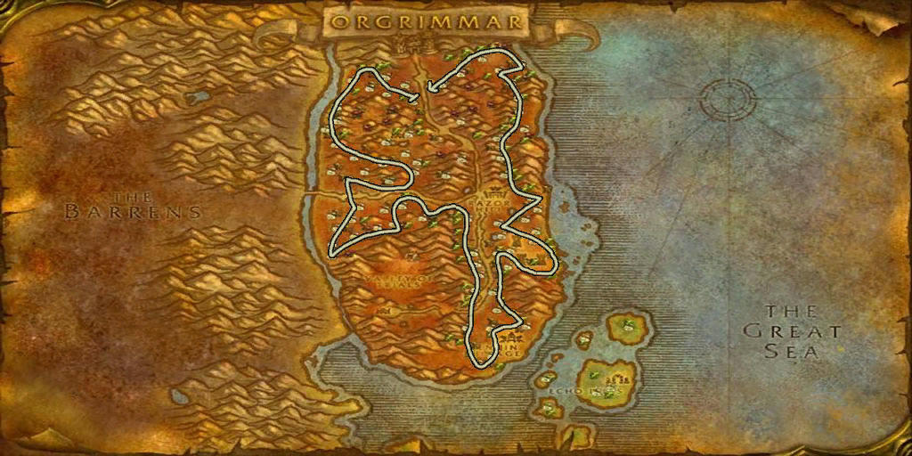
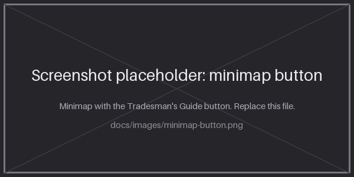

# Tradesman's Guide

An in-game leveling guide for every profession. Pick a trade and get the materials you need, exactly what to craft at each skill range, where to train, and (for Herbalism and Mining) farming route maps for each zone.

Built for **WoW: Forever**.



## Features

- **Eight crafting guides:** Alchemy, Blacksmithing, Cooking, Enchanting, Engineering, First Aid, Leatherworking and Tailoring.
- **Full material lists** up front, so you know what to gather or buy before you start.
- **Step-by-step skill ranges** showing what to craft and the materials each range needs.
- **Trainer locations**, marked by faction: `[H]` Horde, `[A]` Alliance, `[N]` Neutral.
- **Gathering guides** for Herbalism and Mining, split into sections by skill level.
- **Farming route maps** for 19 Herbalism zones and 22 Mining zones, switchable with one click.



Example of a farming route map (Herbalism, Durotar):



## Installation

1. Download this repository (**Code > Download ZIP**) or clone it.
2. Make sure the folder is named exactly `TradeGuide`. Not `TradesmansGuide`, and not a folder nested inside another folder. The map images load from `Interface\AddOns\TradeGuide\Maps`, so the name matters.
3. Put the `TradeGuide` folder in your AddOns directory. For the Forever beta that is:

```
World of Warcraft/_classic_beta_/Interface/AddOns/TradeGuide
```

4. Start the game (or `/reload`) and make sure **Tradesman's Guide** is enabled on the AddOns screen.

The finished layout should look like this:

```
AddOns/
  TradeGuide/
    TradeGuide.toc
    TradeGuide.lua
    alchemy.lua
    blacksmithing.lua
    cooking.lua
    enchanting.lua
    engineering.lua
    firstaid.lua
    herbalism.lua
    leatherworking.lua
    mining.lua
    tailoring.lua
    Maps/
      Herbalism/
      Mining/
```

## Usage

Open the guide with either slash command:

```
/pg
/profguide
```

You can also click the minimap button. Left-click toggles the window, and right-click and drag moves the button.



- Use the buttons on the left to switch professions. Crafting guides are a scrollable list; use the mouse wheel or the scroll bar.
- In **Herbalism** and **Mining**, use **Previous** and **Next** to move between skill-level sections, and the zone buttons to change the route map.
- Drag the window by its body to move it.

The window and minimap button positions are not saved between sessions.

## Notes

- Requires a WoW: Forever client (Interface `16001`, the beta value). The interface number may need to change when Forever releases.
- Every section is stamped in-game. **VERIFIED** means checked against Wowhead's Forever guides (currently First Aid and Cooking, skill 1-225). **UNVERIFIED** means the data is carried over from Vanilla WoW (or taken from third-party guides) and has not been checked for Forever.
- This guide was originally written for Turtle WoW. Recipe, vendor and zone details may differ on Forever, so double-check anything that looks off.
- The original Turtle WoW (1.12) version is preserved in the git history at commit `7edd6c0`. It uses a different API and will not load on Forever.

## Author

trashcanhands
